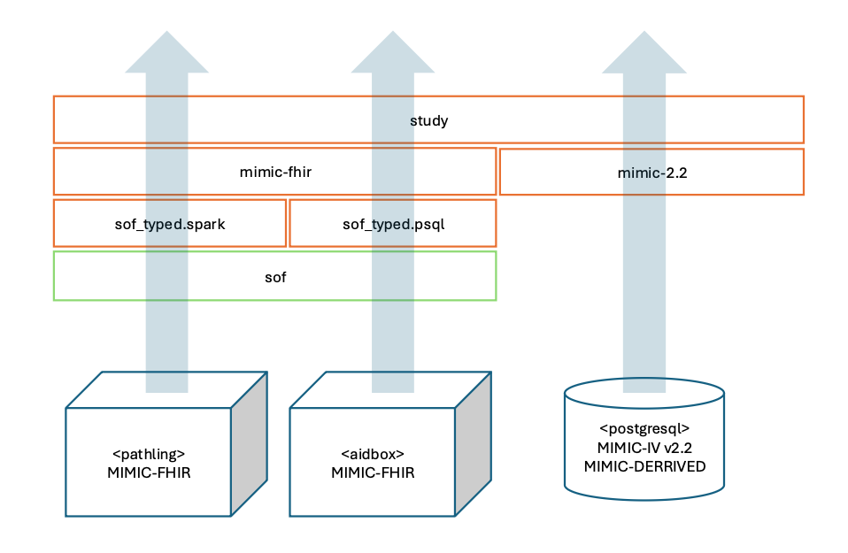

Using SQL on FHIR to reproduce the results of study on racial and differences in oxygen supplementation.
--------------------------------------------------------------------------------------------------------

This in an example of using SQL on FHIR view in combination with ANSI SQL queries to qualitatively 
reproduce selected results of the study:
[Assessment of Racial and Ethnic Differences in Oxygen Supplementation Among Patients in the Intensive Care Unit](https://jamanetwork.com/journals/jamainternalmedicine/fullarticle/2794196).

The focus of this example is 
- the feasibility of using SQL on FHIR/ANSI SQL to select the data required for the study from a FHIR dataset.
- the interoperability of the SQL on FHIR/ANSI SQL views between implementations of FHIR servers.

# Introduction

## The original study

The objective of the original study was to o determine if there are racial and ethnic disparities 
in supplemental oxygen administration associated with inconsistent pulse oximeter performance (for ICU patient).

The analysis was conducted as a retrospective cohort study  based on the Medical Information Mart for Intensive Care (MIMIC)-IV dataset
and concluded that Asian, Black, and Hispanic patients received less supplemental oxygen than White patients, 
and this was associated with differences in pulse oximeter performance.

Although this is not explicitly stated in the study, we concluded that it was based on [MIMIC-VI version 1.0](https://physionet.org/content/mimiciv/1.0/).
Rather than using MIMIC-VI data directly the study was based on the derived concepts (_mimic_derived_) 
available in the BigQuery dataset `physionet-data.mimic_derived` (see: https://github.com/MIT-LCP/mimic-code) 

## The replication

This example demonstrates how SQL on FHIR/ANSI SQL can be used to select the data required for the 
study from FHIR version of the MIMIC-VI.

We intend to qualitatively reproduce the selected results of the study as the exact replication is not possible due to:
- the differences in the MIMIC-IV version used; MIMIC-FHIR is based on MIMIC-VI version 2.2 (not version 1.0 as in the original study)
- lack of sufficient details on data selection and processing in the study
- simplifications and assumptions made in the replication

In particular, we would like to show:
- differences in the oxygen delivery rates between the racial groups (non-parametric Wilcoxon test of the difference of means of the oxygen delivery rates)
- differences in SpO2 for a given hemoglobin oxygen saturation (so2) between races and ethnicities when controlling for gender (simplified regression model 1)

We have made the following assumptions the data selection:
- the 

# View design

# Running the views

## Running with Pathling

## Running with Aidbox

## Running with PostgreSQL

## Resources
- [Assessment of Racial and Ethnic Differences in Oxygen Supplementation Among Patients in the Intensive Care Unit](https://jamanetwork.com/journals/jamainternalmedicine/fullarticle/2794196)